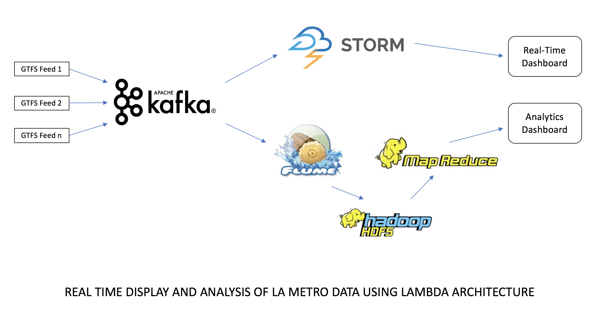

# CMPS-278 - Winter 2017

## Data Pipeline

## Project Abstract
Lambda Architecture (LA) is a system design methodology for robust, scalable and fault-tolerant computing. Some of the design goals of LA include low-latency, fault-tolerance, wide range of workloads and linear scalability. Lambda Architecture can be divided into three parts: __Batch layer, Serving layer and Speed layer__. 

We attempted to build a Lambda Architecture based application that ingests and processes the data from the General Transit Feed Specification (GTFS). To retrieve data from the API, we have a data ingestion component which includes Apache Kafka. The Kafka producer polls the LA Metro GTFS feed and then ingests data into Kafka server. Kafka will feed data to both the batch and the speed layer.

The batch layer is responsible for aggregating data in batches of one hour, one day, one week etc. We have used MapReduce here to aggregate all these values. The speed layer processes the real time data. We have used Apache Storm in this layer which reads the real-time data from Kafka. The data is then processed in Storm to give real-time analytics. Serving layer is our database/datastore which stores the aggregated data. We have used HDFS, where data would be stored in the form of flat files.
